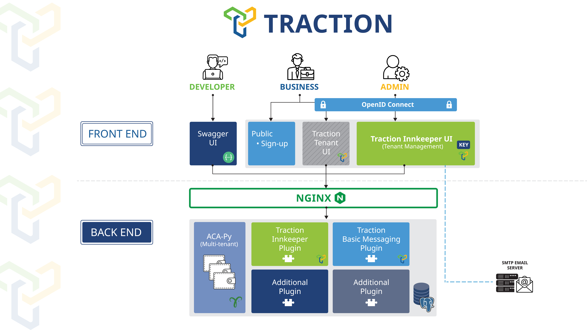

# Projeto SSISystem-SCSAE - Identidade Sistema de Cuidado em Saúde com Anamnese e Exame

<p align="center">
  
</p>

## Índice

- [O que é o SCSAE?](#o-que-é-o-scsae)
- [Comece a usar o SCSAE](#comece-a-usar-o-scsae)
- [Quais são os benefícios de usar o SCSAE?](#quais-são-os-benefícios-de-usar-o-scsae)
- [Do que o SCSAE é composto?](#do-que-o-scsae-é-composto)
- [Comece a contribuir para o SCSAE](#comece-a-contribuir-para-o-scsae)
- [Quem está mantendo o SCSAE?](#quem-está-mantendo-o-scsae)
- [Como o SCSAE é licenciado?](#como-o-scsae-é-licenciado)
- [Engaje-se com a comunidade](#engaje-se-com-a-comunidade)

## O que é o SCSAE?

SCSAE é uma solução de carteira digital composta por plugins sobrepostos ao Hyperledger Aries Cloud Agent Python (ACA-Py) e simplifica o processo de envio e recebimento de credenciais digitais para governos e organizações.

Sua base de código aberto facilita a integração da tecnologia de confiança digital em aplicações de negócios existentes, sem a necessidade de configurar, manter e gerenciar uma instância do ACA-Py. Funcionalidades futuras podem incluir governança legível por máquina e mais.



## Experimente o Sandbox do SCSAE

Estabeleça seu próprio tenant SCSAE em um sandbox do governo de B.C. para emitir, segurar, apresentar e verificar credenciais digitais usando estas [instruções de configuração](./docs/traction-anoncreds-workshop.md).

**Aviso**: Nos dias 1 e 15 de cada mês, todo o sandbox é reiniciado e todo o seu trabalho será perdido.

## Comece a usar o SCSAE

**Executando o SCSAE**: para executar uma instância local do SCSAE, consulte a documentação em [scripts](./scripts/README.md).

**Implantando o SCSAE**: Helm charts para implantar o SCSAE no Kubernetes: [charts](./charts/README.md).

## Quais são os benefícios de usar o SCSAE?

O SCSAE facilita a integração da tecnologia de confiança digital em aplicações de negócios existentes.

- **Arquitetura API-first**: O SCSAE é projetado com uma arquitetura API-first, essa API RESTful permite a integração em aplicações de negócios existentes já utilizadas por organizações. A interface de usuário do Tenant é construída sobre essa API para permitir a adoção antes da integração e para funções de baixo uso.
- **Interoperabilidade Aprimorada**: O Hyperledger Aries torna o SCSAE mais amplamente compatível com tecnologias existentes utilizadas por governos e organizações ao redor do mundo.
- **Multi-tenancy**: Em vez de ter várias ferramentas digitais para integrar com organizações, uma instância escalável do SCSAE pode ser usada para participar do ecossistema de confiança digital, controlar todas as conexões e compartilhar dados mais facilmente.
- **Maior Escalabilidade**: O SCSAE é uma tecnologia de código aberto, incentivando o refinamento colaborativo, lançamentos mais rápidos e maior escalabilidade.

## Do que o SCSAE é composto?

- [ACA-Py + plugins](./plugins/README.md)
- [Tenant UI](./services/tenant-ui/README.md)
- [Serviços de Endorser](./services/endorser/README.md)

## Comece a contribuir para o SCSAE

O SCSAE é um projeto de tecnologia de código aberto que recebe colaborações.

Se você deseja contribuir para o SCSAE, revise o seguinte:

- [Contribuindo](./CONTRIBUTING.md)
- [Código de Conduta](./CODE_OF_CONDUCT.md)
- [Conformidade](./COMPLIANCE.yaml)

## Desenvolvedores: devcontainers

Para ajudar os desenvolvedores, há 2 `devcontainers`: [plugins](./plugins/.devcontainer/devcontainer.json) e [tenant-ui](./services/tenant-ui/.devcontainer/devcontainer.json).

Os devcontainers e os arquivos de inicialização associados do vscode são apenas para conveniência, não são obrigatórios para desenvolver e depurar. Sinta-se à vontade para desenvolver da maneira que preferir.

1. No VS Code, abra `plugins`.
2. Siga todos os prompts para abrir o devcontainer.
3. Em uma segunda janela do VS Code, abra `services/tenant-ui`
4. Siga todos os prompts para abrir o devcontainer.
5. Em `plugins`, inicie a instância ACA-Py / SCSAE: Vista de Execução e Depuração, "Executar/Depurar Plugin", iniciar/F5
6. Em `services/tenant-ui`, inicie a API de backend: Vista de Execução e Depuração, "backend - run dev", iniciar/F5
7. Em `services/tenant-ui`, inicie a API de frontend: Vista de Execução e Depuração, "frontend - run dev", iniciar/F5
8. Em `services/tenant-ui`, carregue um navegador Chrome para depurar o frontend: Vista de Execução e Depuração, "frontend - chrome", iniciar/F5

Se tudo iniciar sem problemas, você deve ser capaz de usar breakpoints no frontend do tenant-ui (Vue/Chrome), na API de backend do tenant-ui (Node.js) e nos plugins do SCSAE (Python) para depuração local.

Fora da caixa, o acima usará as seguintes portas:

- Plugins ACA-Py/SCSAE: 3000, 3001 (admin)
- Proxy de Tenant: 8032
- Banco de Dados do SCSAE: 5432
- Servidor de backend do Tenant UI: 8080
- Servidor de frontend do Tenant UI: 5173

Note que o Proxy de Tenant e o Banco de Dados do SCSAE são iniciados via docker compose ao iniciar os Plugins ACA-Py/SCSAE.

### Fluxo de trabalho do repositório

Atualmente, usuários autorizados podem criar um branch e executar um pull request para mesclar mudanças. Não autorizados sempre podem criar um fork.

#### Rebase de um branch

```bash
git fetch --all
git pull

git rebase origin/main
git push --force
