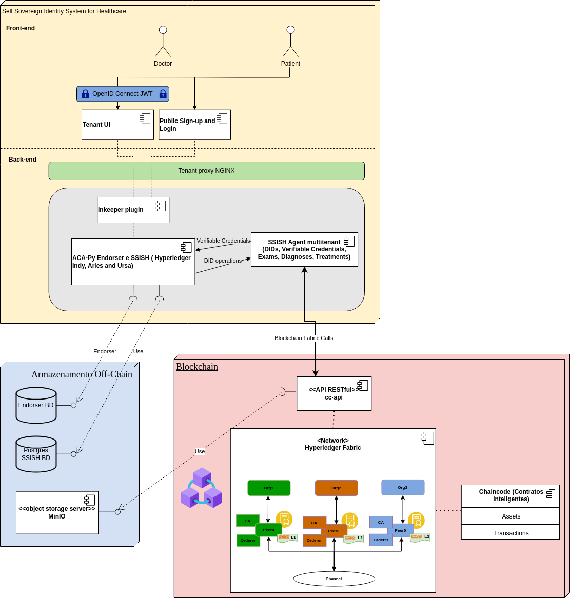

# SSISH - Self Sovereign Identity System for Healthcare
Sistema de Gerenciamento de Identidade Digital Descentralizada Autossoberana Self Sovereign Identity SSISH - INF UFG  TCC - Matheus Lázaro - Ciência da Computação

<p align="center">
  
</p>

```
run:
cd scripts
docker compose up

Erro:
Error response from daemon: driver failed programming external connectivity on endpoint scripts-traction-db-1 (8de0985b6ff5a01042d65f1c47b76690b54f030c34a9d9dbfdac66d0d3c21a0b): Error starting userland proxy: listen tcp4 0.0.0.0:5432: bind: address already in use

sudo lsof -i :5432
sudo kill xxxx
```

``` 
Local SSI System Healthcare:
301a871c-ae73-48b5-aa2d-613d5e96a59a
8df14891-eec8-4883-852c-1beceddf40aa

Local Matheus Lázaro:
eca391e7-078d-49b8-8e3d-dbcfa913d803
57f35a4c-4d4a-402d-9d77-22306ce9dd18

JSON de credencial de identificação de Paciente:

{
    "created_at": 
    "2024-05-17T20:17:45.331336Z",
    "updated_at": 
    "2024-05-17T20:17:45.331336Z",
    "schema_id": 
    "3MsnmYmYXcK316jNxKMG5u:2:Esquema de credencial para Identificação de Paciente - SSISH:1.0",
    "ledger_id": 
    "bcovrin-test",
    "schema": 
    {
        "ver": 
        "1.0",
        "id": 
        "3MsnmYmYXcK316jNxKMG5u:2:Esquema de credencial para Identificação de Paciente - SSISH:1.0",
        "name": 
        "Esquema de credencial para Identificação de Paciente - SSISH",
        "version": 
        "1.0",
        "attrNames": 
    [
        "address",
        "email",
        "birthDate",
        "phone",
        "name",
        "gender"
    ],
    "seqNo": 
    710388
}
}


JSON de verificação de idade (25 anos):
{
  "name": "verifyAgeOver18Years",
  "nonce": "1234567890",
  "version": "1.0",
  "requested_attributes": {
    "attr1": {
      "names": [
        "address",
        "email",
        "phone",
        "name",
        "gender"
      ],
      "restrictions": [
        {
          "schema_name": "Esquema de credencial para Identificação de Paciente - SSISH"
        }
      ]
    }
  },
  "requested_predicates": {
    "age_over_18": {
      "name": "birthDate",
      "p_type": "<=",
      "p_value": 20060517,
      "restrictions": [
        {
          "schema_name": "Esquema de credencial para Identificação de Paciente - SSISH"
        }
      ]
    }
  }
}
```
### Outros tipos de verificação que poderão ser feitos:
verificações de credenciais que podem ser realizadas:

#### Para Pacientes:
Verificação de CPF: Confirmar a validade e a correspondência do CPF com os dados do paciente.

Verificação de Seguro Saúde: Confirmar se o paciente possui seguro e se está ativo.

Verificação de Histórico Médico: Confirmar se o histórico médico do paciente está completo e atualizado.

#### Para Médicos:
Verificação de CRM: Confirmar a validade do CRM e se o médico está em dia com suas obrigações junto ao conselho.

Verificação de Especialidade: Confirmar se o médico possui as especializações declaradas.


## Arquitetura:

**Patient/Doctor**: os usuários finais que utilizam os serviços SSISH. Eles interagem com a interface do usuário para gerenciar suas credenciais digitais e outras funcionalidades relacionadas à identidade digital.

**Admin**: Administradores do sistema que têm acesso a funcionalidades de gestão e configuração do SSISH. Eles podem gerenciar usuários, configurações de segurança e outras operações administrativas.

**Public Sign-up**: Um portal onde novos usuários ou organizações podem se registrar para usar o Traction. É a entrada para que usuários externos criem uma conta e comecem a interagir com o sistema.

**Traction Tenant UI**: A interface do usuário para os inquilinos do Traction. Permite que os usuários gerenciem suas credenciais, conexões e outras funcionalidades relacionadas ao Traction.

**OpenID Connect**: Um protocolo de autenticação baseado em OAuth 2.0 que permite a autenticação de usuários de maneira segura. O Traction utiliza o OpenID Connect para autenticar usuários e administradores.

**Traction Innkeeper UI (Tenant Management)**: Uma interface de usuário específica para a gestão de inquilinos dentro do Traction. Permite que os administradores configurem e gerenciem os inquilinos e suas configurações.

**Key**: Representa as chaves de segurança e criptografia utilizadas para proteger as comunicações e dados dentro do Traction.

**NGINX**: Um servidor web que também atua como um proxy reverso, balanceador de carga e cache HTTP. No Traction, o NGINX é utilizado para gerenciar o tráfego de rede e melhorar a segurança e desempenho.

**ACA-Py (Multi-tenant)**: O Hyperledger Aries Cloud Agent Python (ACA-Py) permite a criação de agentes de identidade digital interoperáveis. A versão multi-tenant do ACA-Py permite que uma única instância do agente sirva a múltiplos inquilinos, cada um com seu próprio espaço isolado e seguro.

**Traction Innkeeper Plugin**: Um plugin que se integra ao ACA-Py para fornecer funcionalidades específicas de gestão de inquilinos no Traction.
**Traction Basic Messaging Plugin**: Um plugin que adiciona funcionalidades básicas de mensagens ao Traction, permitindo a comunicação entre diferentes agentes e usuários dentro do sistema.

**Additional Plugin**: Representa outros plugins adicionais que podem ser integrados ao Traction para estender suas capacidades, como plugins para funcionalidades específicas ou integrações com outros sistemas.

<hr/>
<hr/>
<hr/>
<hr/>
<hr/>
<hr/>
<hr/>
<hr/>
<hr/>
<hr/>
<hr/>
<hr/>
<hr/>
<hr/>
<hr/>
<hr/>
<hr/>
<hr/>
<hr/>
<hr/>
<hr/>


# Projeto SSISH - Self Sovereign Identity System for Healthcare

<p align="center">
  
</p>

## Índice

- [O que é o SSISH?](#o-que-é-o-SSISH)
- [Comece a usar o SSISH](#comece-a-usar-o-SSISH)
- [Quais são os benefícios de usar o SSISH?](#quais-são-os-benefícios-de-usar-o-SSISH)
- [Do que o SSISH é composto?](#do-que-o-SSISH-é-composto)
- [Comece a contribuir para o SSISH](#comece-a-contribuir-para-o-SSISH)
- [Quem está mantendo o SSISH?](#quem-está-mantendo-o-SSISH)
- [Como o SSISH é licenciado?](#como-o-SSISH-é-licenciado)
- [Engaje-se com a comunidade](#engaje-se-com-a-comunidade)

## O que é o SSISH?

SSISH é uma solução de carteira digital composta por plugins sobrepostos ao Hyperledger Aries Cloud Agent Python (ACA-Py) e simplifica o processo de envio e recebimento de credenciais digitais para Pacientes e Médicos.

Este projeto é uma adaptação do código original Traction (pertencente ao projeto Digital Trust - Governo British Columbia - Canadá). Sua base de código aberto facilita a integração da tecnologia de confiança digital em aplicações de negócios existentes, sem a necessidade de configurar, manter e gerenciar uma instância do ACA-Py.

### Arquitetura do sistema

<p align="center">
  
</p>

## Comece a usar o SSISH

**Executando o SSISH**: para executar uma instância local do SSISH, consulte a documentação em [scripts](./scripts/README.md).

## Quais são os benefícios de usar o SSISH?

O SSISH facilita a integração da tecnologia de confiança digital em aplicações de Saúde.

- **Arquitetura API-first**: O SSISH é projetado com uma arquitetura API-first, essa API RESTful permite a integração em aplicações existentes já utilizadas por organizações. A interface de usuário do Tenant é construída sobre essa API para permitir a adoção antes da integração e para funções de baixo uso.
- **Interoperabilidade Aprimorada**: O Hyperledger Aries torna o SSISH mais amplamente compatível com tecnologias existentes utilizadas por governos e organizações ao redor do mundo.
- **Multi-tenancy**: Ao invés de ter várias ferramentas digitais para integrar com organizações, uma instância escalável do SSISH pode ser usada para participar do ecossistema de confiança digital, controlar todas as conexões e compartilhar dados mais facilmente.

## Do que o SSISH é composto?

- [ACA-Py + plugins](./plugins/README.md)
- [Tenant UI](./services/tenant-ui/README.md)
- [Serviços de Endorser](./services/endorser/README.md)

## Dev

- Plugins ACA-Py/SSISH: 3000, 3001 (admin)
- Proxy de Tenant: 8032
- Banco de Dados do SSISH: 5432
- Servidor de backend do Tenant UI: 8080
- Servidor de frontend do Tenant UI: 5173

Note que o Proxy de Tenant e o Banco de Dados do SSISH são iniciados via docker compose ao iniciar os Plugins ACA-Py/SSISH.
