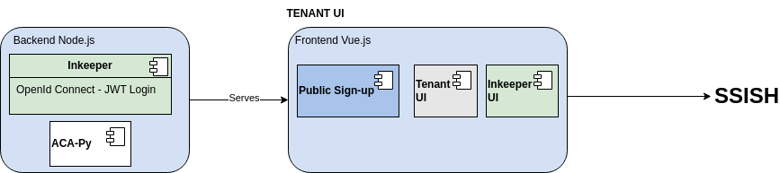

# Interface de Usuário do Tenant Traction

## Visão Geral

A Interface de Usuário do Tenant é um painel web frontend que autenticará uma chave/segredo de carteira e permitirá que um usuário faça chamadas para essa carteira para a API Traction.

A arquitetura consiste em:

- Um aplicativo Node que serve o frontend, lida com a configuração do ambiente e pode fornecer qualquer funcionalidade mínima específica da Interface de Usuário do Tenant (como enviar um e-mail ou algo assim)
- Um aplicativo frontend Vue3 fornecendo a UI



## Configurando sua Configuração

Em tenant-ui/config adicione um arquivo `local.json` para adicionar qualquer configuração específica que você gostaria para sua instância local (caso contrário, veja `default.json` para os padrões). Neste ponto, a única coisa que você provavelmente vai querer substituir é a URL do Traction. Então, seu local.json pode parecer assim, por exemplo:

{ “server”: { “tractionUrl”: “https://traction-api-test.apps.silver.devops.gov.bc.ca/” } }


## Executando o Aplicativo

Para simplesmente iniciar o aplicativo localmente, navegue em um terminal até `services/tenant-ui/` e instale as bibliotecas

```bash
npm ci
cd frontend
npm ci
```

inicie a API de services/tenant-ui/

```bash
npm run start
```

Isso inicia a API e constrói o FE e serve o frontend a partir daqui aqui

## Desenvolvendo
Para desenvolver o backend e o frontend, você vai querer recarregamento rápido e as 2 coisas funcionam como processos separados, então de services/tenant-ui/ execute

```bash
npm ci
npm run dev
```

e então em um terminal separado em services/tenant-ui/frontend

```bash
npm ci
npm run dev
```

O aplicativo Vite de recarga de módulo rápido servirá a partir daqui aqui.

## Executando Testes
Para executar testes simplesmente execute

```bash
npm run test
```

Além de executar testes, isso também produzirá estatísticas de cobertura de código.

Para testar suas alterações no mesmo ambiente que você veria na produção, use

```bash
npm run build
npm run start
```

## Usando docker
Construa e execute uma imagem docker (o exemplo mostra o uso de variável de ambiente para apontar para uma Instância Traction específica)

```bash
docker build . -t local/traction-ui
docker run --env SERVER_TRACTION_URL=https://traction-api-test.apps.silver.devops.gov.bc.ca/ FRONTEND_TENANT_PROXY_URL=https://traction-tenant-proxy-test.apps.silver.devops.gov.bc.ca/ -p 8080:8080 -d local/traction-ui
```

## Internacionalização
A Interface de Usuário do Tenant usa Vue I18n para lidar com a internacionalização para o aplicativo Vue.

Quando estiver desenvolvendo, revise a documentação para a sintaxe básica dessa biblioteca rapidamente para entender os recursos de localização usados. As configurações de internacionalização são tratadas na pasta i18n e as traduções são mantidas em arquivos json para cada idioma lá.

Quando estiver desenvolvendo a Interface de Usuário do Tenant, adira às melhores práticas de localização, incluindo:

Não trate nenhuma lógica de localização ou traduções nos próprios componentes. O código frontend deve lidar apenas com nomes de strings de mensagens, e todas as localizações devem ser tratadas exclusivamente nos arquivos de idiomas json.
Use princípios de design responsivo adequados e não espaçe os componentes da UI com base nos comprimentos de texto do idioma inglês. Elementos da UI traduzidos podem acabar sendo mais curtos ou muito mais longos, então os desbordamentos de texto devem sempre funcionar de acordo.
Atualmente, a localização é tratada no nível do frontend da Interface de Usuário do Tenant, mas os dados que retornam ao frontend das APIs Traction e AcaPy podem não incluir localização de texto e códigos de status, etc. Como tal, a localização completa é um trabalho em andamento e exigirá algum trabalho futuro na integração com Traction e AcaPy.

Para garantir que os arquivos de idiomas sejam consistentes entre si, scripts auxiliares adicionais foram adicionados:

* fill-keys pega tudo em en.json e preenche os outros arquivos de idiomas com as entradas sufixadas pelo código do idioma.
* common-keys olha quais chaves apontam para os mesmos valores para que possam ser refatorados em uma chave comum.
* sort-keys faz exatamente o que diz

Para executar qualquer um desses scripts, navegue até services/tenant-ui/frontend e execute

```bash
npm run i18n:fill-keys
```

Substituindo fill-keys por qualquer script que você gostaria de executar

## Login OIDC para Innkeeper
A funcionalidade Innkeeper da Interface de Usuário do Tenant pode ser configurada para fazer login com (ou ambos)

o segredo do Innkeeper
um provedor OIDC configurado
Para configurar o provedor OIDC de sua escolha, adicione valores de configuração em seu deployment para corresponder aos campos frontend.innkeeperOidc para um cliente de concessão de código de autenticação e configure os campos server.oidc apropriadamente para verificar o JWKS para tokens desse cliente.

Além disso, o segredo do Innkeeper deve estar disponível para o servidor da Interface de Usuário do Tenant, isso é definido na configuração server.innkeeper…

## Simulação de E-mail
O e-mail é usado em vários componentes do tenent-ui para fins de desenvolvimento incluímos maildev para ajudar com o monitoramento e simulação desses e-mails no lugar de um servidor SMTP adequado.

Para habilitar isso, defina as seguintes variáveis de ambiente antes de iniciar o tenant-ui

SERVER_SMTP_SERVER=maildev
SERVER_SMTP_PORT=1025
Para visualizar os e-mails enviados, abra http://localhost:1080/ no seu navegador web

Por padrão, isso já está configurado no arquivo docker-compose. Para uso local, você precisará iniciar o maildev manualmente.

Configurando Matomo
Se você gostaria de usar Matomo para rastreamento, você pode definir a variável de ambiente FRONTEND_MATOMO_URL conforme exposto em custom-environment-variables.json

Se nenhum valor for definido usando qualquer um desses métodos, o código de rastreamento MATOMO nunca será carregado.


